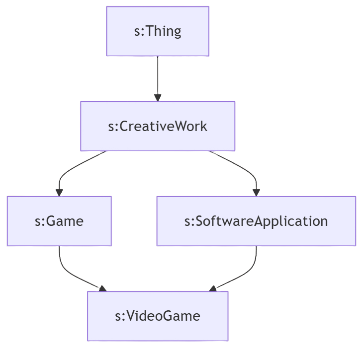
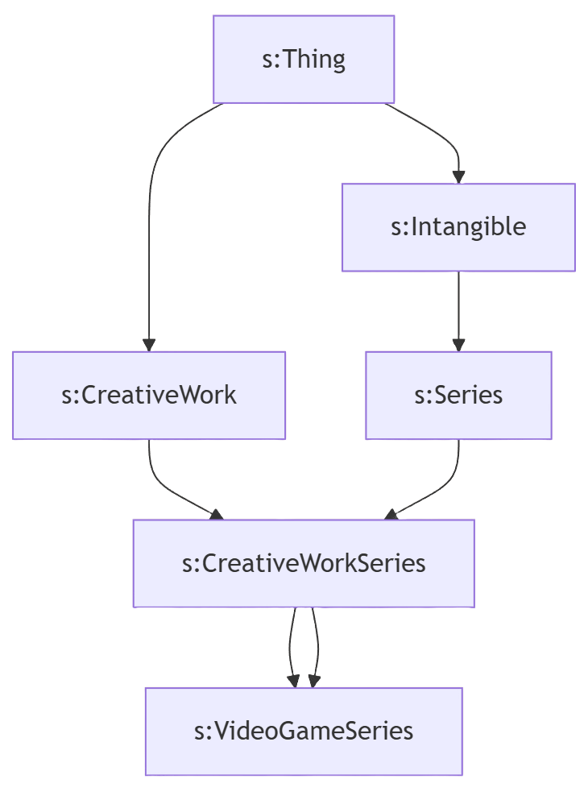
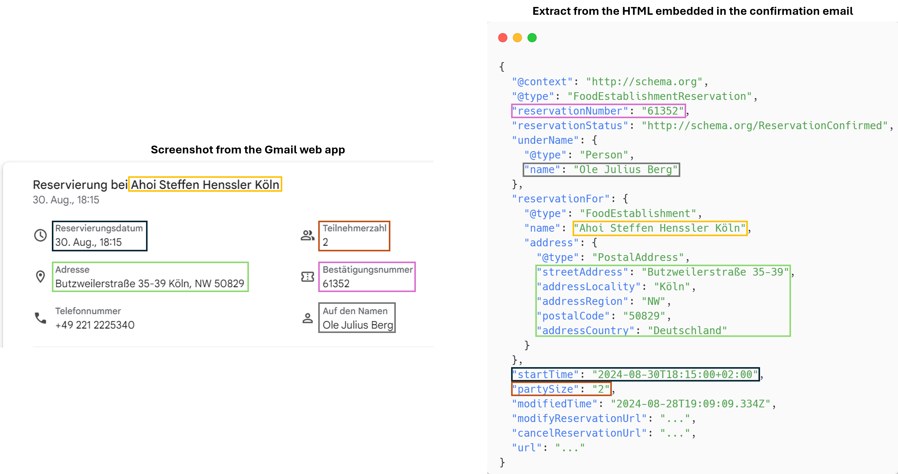

% Schema.org
% Ole Berg
% October 29, 2024

# Table of Contents

1. Motivation and history
2. Basic information
3. Structure of Schema.org
4. Real-world examples
5. Limitations and criticism of Schema.org
6. Conclusion
7. Sources

---

# 1 Motivation and history

* End of 2010s: **Augmentation of search** with structured data

* First focus on 10 verticals (e. g. recipes, events)

* Led to a **proliferation of formats** across search engines and prevented scaling

* In 2011 **joint initiative** by Bing, Google, and Yahoo (and later Yandex)

* **Goal**: *Single* schema across all topics; *single* vocabulary for webmasters

* **Result**: Schema.org

---

# 2 Basic information and usage

* Schema.org is a **vocabulary**, not an ontology

* Designed for **annotation of webpage content**

* Enables rich markup of search results

* Also used in emails, e. g. for reservations in restaurants

* Used by **embedding** Microdata or JSON-LD code in **HTML**

* JSON-LD syntax more popular

* In 2022 **38 % of PLDs** used Schema.org annotations

* Up from 3 % in 2013

---

# 3 Structure of Schema.org

## 3.1 Items and (data) types

* **Items** are things in the **real world**, we wish to describe

* Three hierarchies of types (classes)

  * s:Thing and its subtypes; e. g. s:Event
  * s:DataType and its subtypes; e. g. s:Date
  * s:Enumeration and its subtypes; e. g. s:DayOfWeek

* Types **inherit properties** from one or multiple supertypes

* 811 types, 14 data types, 89 enumerations, 495 enum members

---

# 3 Structure of Schema.org

## 3.2 Structure of the *s:Thing*-hierarchy

**Not a tree structure!**

{ width=40% height=55% }

---

# 3 Structure of Schema.org

## 3.2 Structure of the *s:Thing*-hierarchy (cont.)

{ width=40% height=75% }

---

# 3 Structure of Schema.org

## 3.3 Properties

* Container for the attributes of an item

* Link two types:
  1. Type and data type
  2. Type and another type

* Have domain and range definitions

* 1484 properties

---

# 3 Structure of Schema.org

## 3.4 Domain and range of properties

* **Domain**: Types the property can be used on

* **Range**: Expected types of property values

* Subtypes can **extend range**

* Domain and range are **disjunctive**

---

# 3 Structure of Schema.org

## 3.5 Example of the properties of a type

* s:\textcolor{red}{FoodEstablishmentReservation}

* s:\textcolor{green}{Thing} > s:Intangible > s:\textcolor{blue}{Reservation} > s:\textcolor{red}{FoodEstablishmentReservation}

* Properties:
  * s:startTime | range: *s:Time* or *s:DateTime* | from s:\textcolor{red}{FoodEstablishmentReservation}
  * s:underName | range: s:Person or s:Organization | from s:\textcolor{blue}{Reservation}
  * s:name | range: *s:Text* | from s:\textcolor{green}{Thing}
  * ...many more... (in total 27 = \textcolor{green}{12} + \textcolor{blue}{12} + \textcolor{red}{3})

---

# 4 Real-world examples

## 4.1 Schema.org in emails

{width=80% height=80%}

---

# 4 Real-world examples

## 4.2 Schema.org in rich snippets

Test for yourself: \textcolor{blue}{https://search.google.com/test/rich-results}

---

# 5 Limitations and criticism

* **Explicit** design for **webpage content**

* **Limited transferability** to other domains

* Addressed by hosted and external **extensions**

* Adoption has **plateaued**

* Some criticism of missing local ranges

---

# 6 Conclusion

Thank you for attending my presentation!

Do you think that Schema.org still has **unused potential**? Or are the extensions all we can expect?

---

# 7 Sources I

* R. V. Guha, D. Brickley, und S. Macbeth, "Schema.org: evolution of structured data on the web", Commun. ACM, Bd. 59, Nr. 2, S. 44–51, Jan. 2016, doi: 10.1145/2844544.
* A. Brinkmann, A. Primpeli, und C. Bizer, "The Web Data Commons Schema.org Data Set Series", in *Companion Proceedings of the ACM Web Conference 2023*, Austin TX USA: ACM, Apr. 2023, S. 136–139. doi: 10.1145/3543873.3587331.
* P. F. Patel-Schneider, "Analyzing Schema.org", in *The Semantic Web – ISWC 2014*, Bd. 8796, P. Mika, T. Tudorache, A. Bernstein, C. Welty, C. Knoblock, D. Vrandečić, P. Groth, N. Noy, K. Janowicz, und C. Goble, Hrsg., in Lecture Notes in Computer Science, vol. 8796., Cham: Springer International Publishing, 2014, S. 261–276. doi: 10.1007/978-3-319-11964-9_17.
* W3C, "Schema.org". Zugegriffen: 25. Oktober 2024. \[Online\]. Verfügbar unter: <https://schema.org>

---

# 7 Sources II

* U. Serles und D. Fensel, "Analysis of Schema.org at Five Levels of KR", in *An Introduction to Knowledge Graphs*, Cham: Springer Nature Switzerland, 2024, S. 259–270. doi: 10.1007/978-3-031-45256-7_15.
* P. Hitzler, "A review of the semantic web field", *Commun. ACM*, Bd. 64, Nr. 2, S. 76–83, Jan. 2021, doi: 10.1145/3397512.
